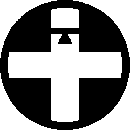
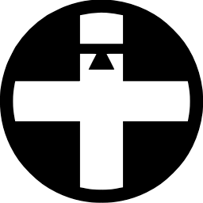
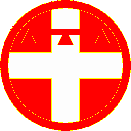
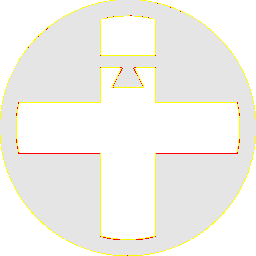
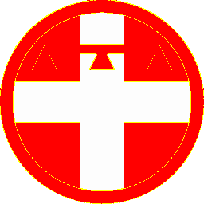

# Visual-diff: `circle-flags:it-21`

Generated 2026-05-16. Phase 1.5 three-way diff (see RESEARCH_PLAN §26 / §33b).

- **Package**: `iconifyx_circle_flags`
- **Primary codepoint**: `0xe09a`
- **Primary font family**: `CircleFlags`
- **Duotone**: no

## Verdict

- **Status**: `different`
- **Primary reason**: `GENERATOR_DIFF`
- **Confidence**: `medium`
- **Problem**: SVG vs TTF mismatch 46.9% (Hamming 0, SSIM 0.56); flutter render matches the TTF — bug is upstream of widget
- **Remediation**: Diff is in generator/font-build pipeline. Manual triage; bump --size to confirm structural

## Frames

| Layer | Image |
|---|---|
| Upstream Iconify SVG (resvg) |  |
| TTF primary glyph (em-box) |  |
| TTF composed (pure-TS, kind=solo) |  |
| Flutter rendered (IconifyIcon, fvm flutter test) |  |

## Diffs

| Pair | Heat-map | Metrics |
|---|---|---|
| SVG vs TTF (generator/build stage) |  | mismatch=46.91% ham=0 ssim=0.561 |
| TTF vs Flutter (widget render stage) |  | mismatch=0.41% ham=0 ssim=0.928 |
| SVG vs Flutter (end-to-end) |  | mismatch=46.73% ham=0 ssim=0.564 |

## Glyph metrics (raw TTF)

| Layer | Font | Glyph name | Advance | LSB | bbox xMin..xMax | bbox yMin..yMax | Centroid |
|---|---|---|---:|---:|---|---|---|
| primary | `CircleFlags.ttf` | `it-21` | 1000 | 0 | 1.0..999.0 | 1.0..999.5 | (500, 500) |

## End-to-end metrics (SVG vs Flutter)

- Canvas: 256 × 256
- Mismatch: 30,623 / 65,536 px (46.73 %)
- Ink ratio upstream: 0.4793
- Ink ratio Flutter:  0.4925
- Centroid drift: (-0.0, -0.3) px
- dHash: `1044808400848444` vs `1044808400848444` (Hamming 0/64)
- SSIM: 0.5635
