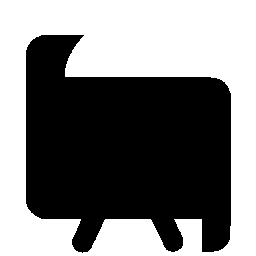
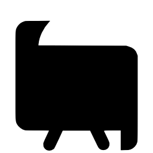
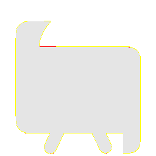

# Visual-diff: `devicon:androidstudio`

Generated 2026-05-16. Phase 1.5 three-way diff (see RESEARCH_PLAN §26 / §33b).

- **Package**: `iconifyx_devicon`
- **Primary codepoint**: `0xe32c`
- **Primary font family**: `Devicon`
- **Duotone**: no

## Verdict

- **Status**: `different`
- **Primary reason**: `GENERATOR_DIFF`
- **Confidence**: `medium`
- **Problem**: SVG vs TTF mismatch 57.0% (Hamming 7, SSIM 0.48); flutter render matches the TTF — bug is upstream of widget
- **Remediation**: Diff is in generator/font-build pipeline. Manual triage; bump --size to confirm structural

## Frames

| Layer | Image |
|---|---|
| Upstream Iconify SVG (resvg) |  |
| TTF primary glyph (em-box) |  |
| TTF composed (pure-TS, kind=solo) |  |
| Flutter rendered (IconifyIcon, fvm flutter test) |  |

## Diffs

| Pair | Heat-map | Metrics |
|---|---|---|
| SVG vs TTF (generator/build stage) |  | mismatch=57.04% ham=7 ssim=0.480 |
| TTF vs Flutter (widget render stage) |  | mismatch=0.05% ham=0 ssim=0.985 |
| SVG vs Flutter (end-to-end) |  | mismatch=56.82% ham=7 ssim=0.490 |

## Glyph metrics (raw TTF)

| Layer | Font | Glyph name | Advance | LSB | bbox xMin..xMax | bbox yMin..yMax | Centroid |
|---|---|---|---:|---:|---|---|---|
| primary | `Devicon.ttf` | `androidstudio` | 1000 | 0 | 102.0..899.0 | 15.6..862.0 | (501, 439) |

## End-to-end metrics (SVG vs Flutter)

- Canvas: 256 × 256
- Mismatch: 37,239 / 65,536 px (56.82 %)
- Ink ratio upstream: 0.4961
- Ink ratio Flutter:  0.5016
- Centroid drift: (-0.1, -0.4) px
- dHash: `0010808091919125` vs `0000808080808025` (Hamming 7/64)
- SSIM: 0.4899
