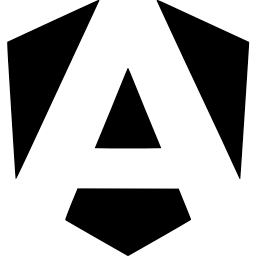
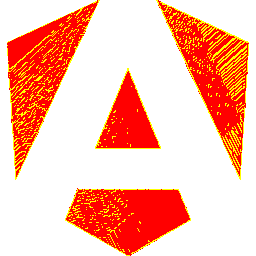
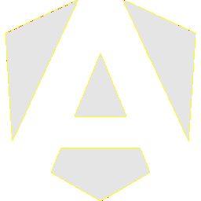

# Visual-diff: `devicon:angular`

Generated 2026-05-16. Phase 1.5 three-way diff (see RESEARCH_PLAN §26 / §33b).

- **Package**: `iconifyx_devicon`
- **Primary codepoint**: `0xe012`
- **Primary font family**: `Devicon`
- **Duotone**: no

## Verdict

- **Status**: `different`
- **Primary reason**: `GENERATOR_DIFF`
- **Confidence**: `medium`
- **Problem**: SVG vs TTF mismatch 26.5% (Hamming 9, SSIM 0.68); flutter render matches the TTF — bug is upstream of widget
- **Remediation**: Diff is in generator/font-build pipeline. Manual triage; bump --size to confirm structural

## Frames

| Layer | Image |
|---|---|
| Upstream Iconify SVG (resvg) |  |
| TTF primary glyph (em-box) |  |
| TTF composed (pure-TS, kind=solo) |  |
| Flutter rendered (IconifyIcon, fvm flutter test) |  |

## Diffs

| Pair | Heat-map | Metrics |
|---|---|---|
| SVG vs TTF (generator/build stage) |  | mismatch=26.54% ham=9 ssim=0.684 |
| TTF vs Flutter (widget render stage) |  | mismatch=0.04% ham=2 ssim=0.969 |
| SVG vs Flutter (end-to-end) |  | mismatch=27.19% ham=9 ssim=0.691 |

## Glyph metrics (raw TTF)

| Layer | Font | Glyph name | Advance | LSB | bbox xMin..xMax | bbox yMin..yMax | Centroid |
|---|---|---|---:|---:|---|---|---|
| primary | `Devicon.ttf` | `angular` | 1000 | 0 | 29.2..972.0 | 0.0..998.1 | (501, 499) |

## End-to-end metrics (SVG vs Flutter)

- Canvas: 256 × 256
- Mismatch: 17,819 / 65,536 px (27.19 %)
- Ink ratio upstream: 0.2782
- Ink ratio Flutter:  0.3338
- Centroid drift: (-13.8, -12.4) px
- dHash: `00c2c38199003c2c` vs `0082828191002020` (Hamming 9/64)
- SSIM: 0.6913
