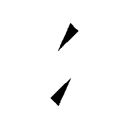
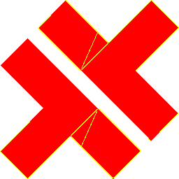
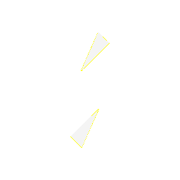
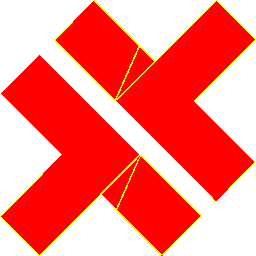

# Visual-diff: `devicon:capacitor`

Generated 2026-05-16. Phase 1.5 three-way diff (see RESEARCH_PLAN §26 / §33b).

- **Package**: `iconifyx_devicon`
- **Primary codepoint**: `0xe059`
- **Primary font family**: `Devicon`
- **Duotone**: yes (kind=hint)
- **Secondary font family**: `DeviconSecondary`

## Verdict

- **Status**: `different`
- **Primary reason**: `EMPTY_GLYPH`
- **Confidence**: `high`
- **Problem**: Primary glyph has empty outline in TTF
- **Remediation**: Check FONT_AUDIT.md; svg2ttf likely dropped this glyph during build

## Frames

| Layer | Image |
|---|---|
| Upstream Iconify SVG (resvg) |  |
| TTF primary glyph (em-box) |  |
| TTF secondary glyph (em-box) |  |
| TTF composed (pure-TS, kind=hint) |  |
| Flutter rendered (IconifyIcon, fvm flutter test) |  |

## Diffs

| Pair | Heat-map | Metrics |
|---|---|---|
| SVG vs TTF (generator/build stage) |  | mismatch=51.92% ham=13 ssim=0.749 |
| TTF vs Flutter (widget render stage) |  | mismatch=0.00% ham=0 ssim=0.995 |
| SVG vs Flutter (end-to-end) |  | mismatch=51.76% ham=13 ssim=0.750 |

## Glyph metrics (raw TTF)

| Layer | Font | Glyph name | Advance | LSB | bbox xMin..xMax | bbox yMin..yMax | Centroid |
|---|---|---|---:|---:|---|---|---|
| primary | `Devicon.ttf` | _empty glyph_ | — | — | — | — | — |
| secondary | `DeviconSecondary.ttf` | `capacitor` | 1000 | 0 | 394.0..606.0 | 181.5..818.0 | (500, 500) |

## End-to-end metrics (SVG vs Flutter)

- Canvas: 256 × 256
- Mismatch: 33,920 / 65,536 px (51.76 %)
- Ink ratio upstream: 0.1430
- Ink ratio Flutter:  0.0000
- Centroid drift: (0.6, 0.8) px
- dHash: `00222890444a9088` vs `0000080000001000` (Hamming 13/64)
- SSIM: 0.7503
