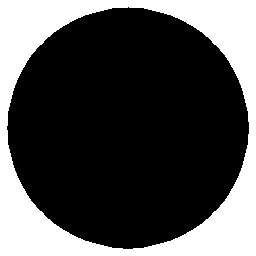

# Visual-diff: `emojione:aquarius`

Generated 2026-05-16. Phase 1.5 three-way diff (see RESEARCH_PLAN §26 / §33b).

- **Package**: `iconifyx_emojione`
- **Primary codepoint**: `0xe1f7`
- **Primary font family**: `Emojione`
- **Duotone**: yes (kind=paintOrder)
- **Secondary font family**: `EmojioneSecondary`

## Verdict

- **Status**: `different`
- **Primary reason**: `GENERATOR_DIFF`
- **Confidence**: `medium`
- **Problem**: SVG vs TTF mismatch 56.2% (Hamming 3, SSIM 0.36); flutter render matches the TTF — bug is upstream of widget
- **Remediation**: Diff is in generator/font-build pipeline. Manual triage; bump --size to confirm structural

## Frames

| Layer | Image |
|---|---|
| Upstream Iconify SVG (resvg) |  |
| TTF primary glyph (em-box) |  |
| TTF secondary glyph (em-box) |  |
| TTF composed (pure-TS, kind=paintOrder) |  |
| Flutter rendered (IconifyIcon, fvm flutter test) |  |

## Diffs

| Pair | Heat-map | Metrics |
|---|---|---|
| SVG vs TTF (generator/build stage) |  | mismatch=56.21% ham=3 ssim=0.365 |
| TTF vs Flutter (widget render stage) |  | mismatch=0.05% ham=1 ssim=0.951 |
| SVG vs Flutter (end-to-end) |  | mismatch=55.37% ham=2 ssim=0.372 |

## Glyph metrics (raw TTF)

| Layer | Font | Glyph name | Advance | LSB | bbox xMin..xMax | bbox yMin..yMax | Centroid |
|---|---|---|---:|---:|---|---|---|
| primary | `Emojione.ttf` | `antenna-bars` | 1000 | 0 | 31.0..969.0 | 31.0..969.0 | (500, 500) |
| secondary | `EmojioneSecondary.ttf` | `aquarius` | 1000 | 0 | 203.9..797.0 | 282.7..720.1 | (500, 501) |

## End-to-end metrics (SVG vs Flutter)

- Canvas: 256 × 256
- Mismatch: 36,286 / 65,536 px (55.37 %)
- Ink ratio upstream: 0.5480
- Ink ratio Flutter:  0.5852
- Centroid drift: (0.4, -0.2) px
- dHash: `0040809980998060` vs `0040809180918060` (Hamming 2/64)
- SSIM: 0.3718

## Duotone alignment (TTF-space)

- **Primary centroid**: (500.0, 500.0) in em-units of 1000
- **Secondary centroid**: (500.5, 501.4)
- **Centroid delta**: (0.5, 1.4) em-units
- **Fraction of em**: (0.0 %, 0.1 %)
