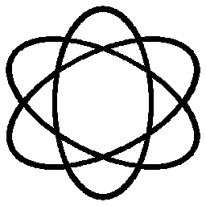
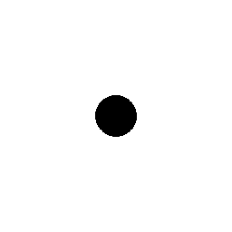
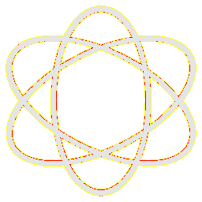

# Visual-diff: `emojione:atom-symbol`

Generated 2026-05-16. Phase 1.5 three-way diff (see RESEARCH_PLAN §26 / §33b).

- **Package**: `iconifyx_emojione`
- **Primary codepoint**: `0xe007`
- **Primary font family**: `Emojione`
- **Duotone**: yes (kind=paintOrder)
- **Secondary font family**: `EmojioneSecondary`

## Verdict

- **Status**: `different`
- **Primary reason**: `GENERATOR_DIFF`
- **Confidence**: `medium`
- **Problem**: SVG vs TTF mismatch 18.4% (Hamming 2, SSIM 0.83); flutter render matches the TTF — bug is upstream of widget
- **Remediation**: Diff is in generator/font-build pipeline. Manual triage; bump --size to confirm structural

## Frames

| Layer | Image |
|---|---|
| Upstream Iconify SVG (resvg) |  |
| TTF primary glyph (em-box) |  |
| TTF secondary glyph (em-box) |  |
| TTF composed (pure-TS, kind=paintOrder) |  |
| Flutter rendered (IconifyIcon, fvm flutter test) |  |

## Diffs

| Pair | Heat-map | Metrics |
|---|---|---|
| SVG vs TTF (generator/build stage) |  | mismatch=18.41% ham=2 ssim=0.830 |
| TTF vs Flutter (widget render stage) |  | mismatch=1.18% ham=4 ssim=0.848 |
| SVG vs Flutter (end-to-end) |  | mismatch=18.34% ham=4 ssim=0.822 |

## Glyph metrics (raw TTF)

| Layer | Font | Glyph name | Advance | LSB | bbox xMin..xMax | bbox yMin..yMax | Centroid |
|---|---|---|---:|---:|---|---|---|
| primary | `Emojione.ttf` | `atom-symbol` | 1000 | 0 | 30.2..969.8 | 31.0..969.0 | (500, 500) |
| secondary | `EmojioneSecondary.ttf` | `atom-symbol` | 1000 | 0 | 412.0..587.5 | 413.0..588.0 | (500, 501) |

## End-to-end metrics (SVG vs Flutter)

- Canvas: 256 × 256
- Mismatch: 12,021 / 65,536 px (18.34 %)
- Ink ratio upstream: 0.1940
- Ink ratio Flutter:  0.2008
- Centroid drift: (-0.1, -0.4) px
- dHash: `0000104291021000` vs `0000104281429100` (Hamming 4/64)
- SSIM: 0.8219

## Duotone alignment (TTF-space)

- **Primary centroid**: (500.0, 500.0) in em-units of 1000
- **Secondary centroid**: (499.8, 500.5)
- **Centroid delta**: (-0.2, 0.5) em-units
- **Fraction of em**: (0.0 %, 0.1 %)
