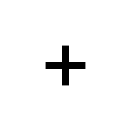
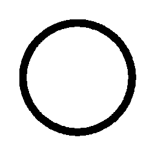
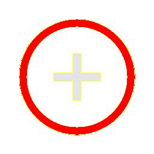
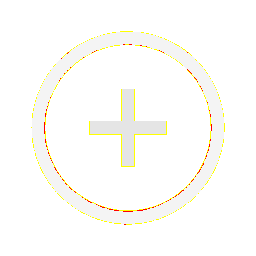
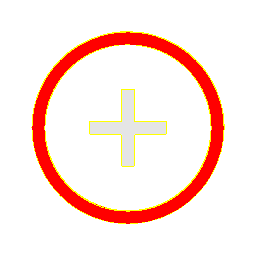

# Visual-diff: `lets-icons:add-ring-duotone-line`

Generated 2026-05-16. Phase 1.5 three-way diff (see RESEARCH_PLAN §26 / §33b).

- **Package**: `iconifyx_lets_icons`
- **Primary codepoint**: `0xe00c`
- **Primary font family**: `LetsIcons`
- **Duotone**: yes (kind=maskInternal)
- **Secondary font family**: `LetsIconsSecondary`

## Verdict

- **Status**: `needs-review`
- **Primary reason**: `MINOR_DIFF_3WAY`
- **Confidence**: `low`
- **Problem**: One or more pairwise diffs in the mild-mismatch band (likely AA noise or opacity)
- **Remediation**: Manual inspect; bump --size to confirm if structural

## Frames

| Layer | Image |
|---|---|
| Upstream Iconify SVG (resvg) |  |
| TTF primary glyph (em-box) |  |
| TTF secondary glyph (em-box) |  |
| TTF composed (pure-TS, kind=maskInternal) |  |
| Flutter rendered (IconifyIcon, fvm flutter test) |  |

## Diffs

| Pair | Heat-map | Metrics |
|---|---|---|
| SVG vs TTF (generator/build stage) |  | mismatch=10.13% ham=2 ssim=0.939 |
| TTF vs Flutter (widget render stage) |  | mismatch=0.29% ham=4 ssim=0.956 |
| SVG vs Flutter (end-to-end) |  | mismatch=10.06% ham=2 ssim=0.950 |

## Glyph metrics (raw TTF)

| Layer | Font | Glyph name | Advance | LSB | bbox xMin..xMax | bbox yMin..yMax | Centroid |
|---|---|---|---:|---:|---|---|---|
| primary | `LetsIcons.ttf` | `add-ring-duotone` | 1000 | 0 | 350.0..650.0 | 350.0..650.0 | (500, 500) |
| secondary | `LetsIconsSecondary.ttf` | `add-duotone-line` | 1000 | 0 | 125.0..875.5 | 124.7..874.5 | (500, 500) |

## End-to-end metrics (SVG vs Flutter)

- Canvas: 256 × 256
- Mismatch: 6,595 / 65,536 px (10.06 %)
- Ink ratio upstream: 0.0291
- Ink ratio Flutter:  0.0291
- Centroid drift: (0.0, -1.0) px
- dHash: `0000420010004200` vs `0018420010004200` (Hamming 2/64)
- SSIM: 0.9501

## Duotone alignment (TTF-space)

- **Primary centroid**: (500.0, 500.0) in em-units of 1000
- **Secondary centroid**: (500.2, 499.6)
- **Centroid delta**: (0.2, -0.4) em-units
- **Fraction of em**: (0.0 %, 0.0 %)
