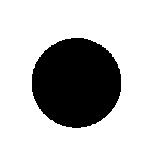

# Visual-diff: `lets-icons:alarmclock-duotone-line`

Generated 2026-05-16. Phase 1.5 three-way diff (see RESEARCH_PLAN §26 / §33b).

- **Package**: `iconifyx_lets_icons`
- **Primary codepoint**: `0xe01f`
- **Primary font family**: `LetsIcons`
- **Duotone**: yes (kind=hint)
- **Secondary font family**: `LetsIconsSecondary`

## Verdict

- **Status**: `needs-review`
- **Primary reason**: `MINOR_DIFF_3WAY`
- **Confidence**: `low`
- **Problem**: One or more pairwise diffs in the mild-mismatch band (likely AA noise or opacity)
- **Remediation**: Manual inspect; bump --size to confirm if structural

## Frames

| Layer | Image |
|---|---|
| Upstream Iconify SVG (resvg) |  |
| TTF primary glyph (em-box) |  |
| TTF secondary glyph (em-box) |  |
| TTF composed (pure-TS, kind=hint) |  |
| Flutter rendered (IconifyIcon, fvm flutter test) |  |

## Diffs

| Pair | Heat-map | Metrics |
|---|---|---|
| SVG vs TTF (generator/build stage) |  | mismatch=20.39% ham=0 ssim=0.965 |
| TTF vs Flutter (widget render stage) |  | mismatch=0.26% ham=0 ssim=0.954 |
| SVG vs Flutter (end-to-end) |  | mismatch=19.72% ham=0 ssim=0.956 |

## Glyph metrics (raw TTF)

| Layer | Font | Glyph name | Advance | LSB | bbox xMin..xMax | bbox yMin..yMax | Centroid |
|---|---|---|---:|---:|---|---|---|
| primary | `LetsIcons.ttf` | `alarmclock-duotone-line` | 1000 | 0 | 99.9..900.1 | 141.6..816.5 | (500, 479) |
| secondary | `LetsIconsSecondary.ttf` | `alarmclock-duotone-line` | 1000 | 0 | 208.2..791.7 | 166.4..749.6 | (500, 458) |

## End-to-end metrics (SVG vs Flutter)

- Canvas: 256 × 256
- Mismatch: 12,926 / 65,536 px (19.72 %)
- Ink ratio upstream: 0.1244
- Ink ratio Flutter:  0.1336
- Centroid drift: (-0.1, -0.6) px
- dHash: `0000102052422400` vs `0000102052422400` (Hamming 0/64)
- SSIM: 0.9563

## Duotone alignment (TTF-space)

- **Primary centroid**: (500.0, 479.0) in em-units of 1000
- **Secondary centroid**: (499.9, 458.0)
- **Centroid delta**: (-0.1, -21.0) em-units
- **Fraction of em**: (0.0 %, 2.1 %)
