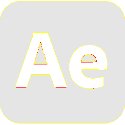

# Visual-diff: `logos:adobe-after-effects`

Generated 2026-05-16. Phase 1.5 three-way diff (see RESEARCH_PLAN §26 / §33b).

- **Package**: `iconifyx_logos`
- **Primary codepoint**: `0xe004`
- **Primary font family**: `Logos`
- **Duotone**: yes (kind=paintOrder)
- **Secondary font family**: `LogosSecondary`

## Verdict

- **Status**: `different`
- **Primary reason**: `GENERATOR_DIFF`
- **Confidence**: `medium`
- **Problem**: SVG vs TTF mismatch 93.5% (Hamming 3, SSIM 0.28); flutter render matches the TTF — bug is upstream of widget
- **Remediation**: Diff is in generator/font-build pipeline. Manual triage; bump --size to confirm structural

## Frames

| Layer | Image |
|---|---|
| Upstream Iconify SVG (resvg) |  |
| TTF primary glyph (em-box) |  |
| TTF secondary glyph (em-box) |  |
| TTF composed (pure-TS, kind=paintOrder) |  |
| Flutter rendered (IconifyIcon, fvm flutter test) |  |

## Diffs

| Pair | Heat-map | Metrics |
|---|---|---|
| SVG vs TTF (generator/build stage) |  | mismatch=93.52% ham=3 ssim=0.282 |
| TTF vs Flutter (widget render stage) |  | mismatch=0.23% ham=2 ssim=0.955 |
| SVG vs Flutter (end-to-end) |  | mismatch=92.83% ham=1 ssim=0.292 |

## Glyph metrics (raw TTF)

| Layer | Font | Glyph name | Advance | LSB | bbox xMin..xMax | bbox yMin..yMax | Centroid |
|---|---|---|---:|---:|---|---|---|
| primary | `Logos.ttf` | `adobe-after-effects` | 1024 | 0 | 0.0..1024.0 | 2.0..1000.0 | (512, 501) |
| secondary | `LogosSecondary.ttf` | `adobe-after-effects` | 1024 | 0 | 126.6..878.0 | 287.0..744.0 | (502, 516) |

## End-to-end metrics (SVG vs Flutter)

- Canvas: 256 × 256
- Mismatch: 60,838 / 65,536 px (92.83 %)
- Ink ratio upstream: 0.8002
- Ink ratio Flutter:  0.7923
- Centroid drift: (-0.0, -0.5) px
- dHash: `00800011292b0080` vs `0080001129290080` (Hamming 1/64)
- SSIM: 0.2921

## Duotone alignment (TTF-space)

- **Primary centroid**: (512.0, 501.0) in em-units of 1000
- **Secondary centroid**: (502.3, 515.5)
- **Centroid delta**: (-9.7, 14.5) em-units
- **Fraction of em**: (1.0 %, 1.5 %)
