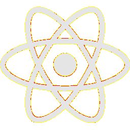

# Visual-diff: `logos:react`

Generated 2026-05-16. Phase 1.5 three-way diff (see RESEARCH_PLAN §26 / §33b).

- **Package**: `iconifyx_logos`
- **Primary codepoint**: `0xe25f`
- **Primary font family**: `Logos`
- **Duotone**: no

## Verdict

- **Status**: `different`
- **Primary reason**: `GENERATOR_DIFF`
- **Confidence**: `medium`
- **Problem**: SVG vs TTF mismatch 25.9% (Hamming 4, SSIM 0.70); flutter render matches the TTF — bug is upstream of widget
- **Remediation**: Diff is in generator/font-build pipeline. Manual triage; bump --size to confirm structural

## Frames

| Layer | Image |
|---|---|
| Upstream Iconify SVG (resvg) |  |
| TTF primary glyph (em-box) |  |
| TTF composed (pure-TS, kind=solo) |  |
| Flutter rendered (IconifyIcon, fvm flutter test) |  |

## Diffs

| Pair | Heat-map | Metrics |
|---|---|---|
| SVG vs TTF (generator/build stage) |  | mismatch=25.90% ham=4 ssim=0.697 |
| TTF vs Flutter (widget render stage) |  | mismatch=1.16% ham=4 ssim=0.863 |
| SVG vs Flutter (end-to-end) |  | mismatch=25.64% ham=0 ssim=0.693 |

## Glyph metrics (raw TTF)

| Layer | Font | Glyph name | Advance | LSB | bbox xMin..xMax | bbox yMin..yMax | Centroid |
|---|---|---|---:|---:|---|---|---|
| primary | `Logos.ttf` | `react` | 1122 | -1 | 0.0..1123.0 | 0.8..1000.0 | (562, 500) |

## End-to-end metrics (SVG vs Flutter)

- Canvas: 256 × 256
- Mismatch: 16,804 / 65,536 px (25.64 %)
- Ink ratio upstream: 0.0000
- Ink ratio Flutter:  0.2928
- Centroid drift: (-0.3, -1.0) px
- dHash: `005252a510825252` vs `005252a510825252` (Hamming 0/64)
- SSIM: 0.6930
