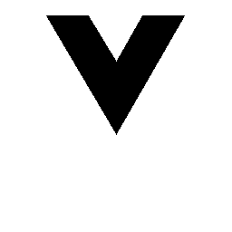
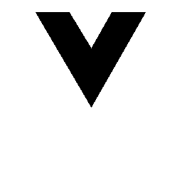
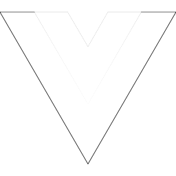
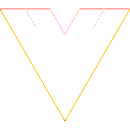

# Visual-diff: `logos:vue`

Generated 2026-05-16. Phase 1.5 three-way diff (see RESEARCH_PLAN §26 / §33b).

- **Package**: `iconifyx_logos`
- **Primary codepoint**: `0xe600`
- **Primary font family**: `Logos`
- **Duotone**: yes (kind=paintOrder)
- **Secondary font family**: `LogosSecondary`

## Verdict

- **Status**: `different`
- **Primary reason**: `DUOTONE_BBOX_MISMATCH`
- **Confidence**: `high`
- **Problem**: Primary glyph centroid (579,501) differs from secondary (578,699) by 0.1% / 19.9% of em — layers will overlay misaligned
- **Remediation**: GLYPH_METRICS_AUDIT.md likely flags this pair. Root cause is usually svg2ttf glyph dedup (identical SVG bodies collapsed into one glyph with whichever first-encountered xMin) — see RESEARCH_PLAN §33 for fix.

## Frames

| Layer | Image |
|---|---|
| Upstream Iconify SVG (resvg) |  |
| TTF primary glyph (em-box) |  |
| TTF secondary glyph (em-box) |  |
| TTF composed (pure-TS, kind=paintOrder) |  |
| Flutter rendered (IconifyIcon, fvm flutter test) |  |

## Diffs

| Pair | Heat-map | Metrics |
|---|---|---|
| SVG vs TTF (generator/build stage) |  | mismatch=39.69% ham=10 ssim=0.777 |
| TTF vs Flutter (widget render stage) |  | mismatch=0.68% ham=0 ssim=0.885 |
| SVG vs Flutter (end-to-end) |  | mismatch=39.29% ham=10 ssim=0.768 |

## Glyph metrics (raw TTF)

| Layer | Font | Glyph name | Advance | LSB | bbox xMin..xMax | bbox yMin..yMax | Centroid |
|---|---|---|---:|---:|---|---|---|
| primary | `Logos.ttf` | `vue` | 1158 | 0 | 0.0..1158.0 | 1.0..1000.0 | (579, 501) |
| secondary | `LogosSecondary.ttf` | `vue` | 1158 | 0 | 229.0..927.0 | 398.0..1000.0 | (578, 699) |

## End-to-end metrics (SVG vs Flutter)

- Canvas: 256 × 256
- Mismatch: 25,748 / 65,536 px (39.29 %)
- Ink ratio upstream: 0.1338
- Ink ratio Flutter:  0.0074
- Centroid drift: (0.0, 38.0) px
- dHash: `00a4a05020201000` vs `0000000000000000` (Hamming 10/64)
- SSIM: 0.7682

## Duotone alignment (TTF-space)

- **Primary centroid**: (579.0, 500.5) in em-units of 1000
- **Secondary centroid**: (578.0, 699.0)
- **Centroid delta**: (-1.0, 198.5) em-units
- **Fraction of em**: (0.1 %, 19.9 %)

> WARN: Centroid drift exceeds the 4 % threshold beyond which the two layers will visibly overlay out of alignment.
