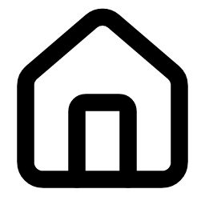
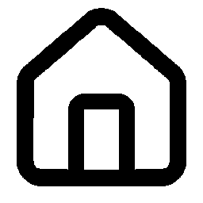
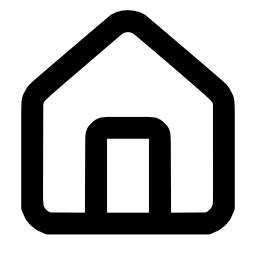
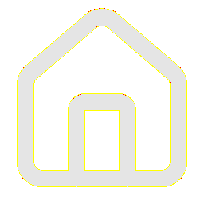
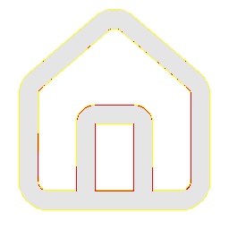
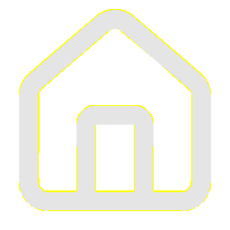

# Visual-diff: `lucide:house`

Generated 2026-05-16. Phase 1.5 three-way diff (see RESEARCH_PLAN §26 / §33b).

- **Package**: `iconifyx_lucide`
- **Primary codepoint**: `0xef0c`
- **Primary font family**: `Lucide`
- **Duotone**: no

## Verdict

- **Status**: `needs-review`
- **Primary reason**: `MINOR_DIFF_3WAY`
- **Confidence**: `low`
- **Problem**: One or more pairwise diffs in the mild-mismatch band (likely AA noise or opacity)
- **Remediation**: Manual inspect; bump --size to confirm if structural

## Frames

| Layer | Image |
|---|---|
| Upstream Iconify SVG (resvg) |  |
| TTF primary glyph (em-box) |  |
| TTF composed (pure-TS, kind=solo) |  |
| Flutter rendered (IconifyIcon, fvm flutter test) |  |

## Diffs

| Pair | Heat-map | Metrics |
|---|---|---|
| SVG vs TTF (generator/build stage) |  | mismatch=0.05% ham=5 ssim=0.971 |
| TTF vs Flutter (widget render stage) |  | mismatch=0.81% ham=4 ssim=0.958 |
| SVG vs Flutter (end-to-end) |  | mismatch=0.00% ham=1 ssim=0.984 |

## Glyph metrics (raw TTF)

| Layer | Font | Glyph name | Advance | LSB | bbox xMin..xMax | bbox yMin..yMax | Centroid |
|---|---|---|---:|---:|---|---|---|
| primary | `Lucide.ttf` | `home` | 1000 | 0 | 84.0..916.0 | 84.0..958.0 | (500, 521) |

## End-to-end metrics (SVG vs Flutter)

- Canvas: 256 × 256
- Mismatch: 0 / 65,536 px (0.00 %)
- Ink ratio upstream: 0.2970
- Ink ratio Flutter:  0.2991
- Centroid drift: (-0.0, -1.5) px
- dHash: `0010468191a5a540` vs `0010448191a5a540` (Hamming 1/64)
- SSIM: 0.9838
