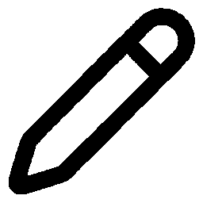
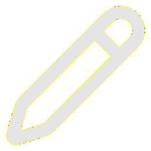
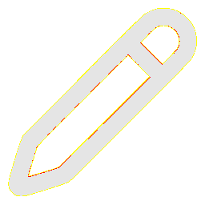
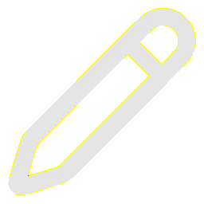

# Visual-diff: `lucide:pencil`

Generated 2026-05-16. Phase 1.5 three-way diff (see RESEARCH_PLAN §26 / §33b).

- **Package**: `iconifyx_lucide`
- **Primary codepoint**: `0xf4c4`
- **Primary font family**: `Lucide`
- **Duotone**: no

## Verdict

- **Status**: `same`
- **Primary reason**: `OK_3WAY`
- **Confidence**: `high`
- **Problem**: —
- **Remediation**: —

## Frames

| Layer | Image |
|---|---|
| Upstream Iconify SVG (resvg) |  |
| TTF primary glyph (em-box) |  |
| TTF composed (pure-TS, kind=solo) |  |
| Flutter rendered (IconifyIcon, fvm flutter test) |  |

## Diffs

| Pair | Heat-map | Metrics |
|---|---|---|
| SVG vs TTF (generator/build stage) |  | mismatch=0.04% ham=0 ssim=0.966 |
| TTF vs Flutter (widget render stage) |  | mismatch=0.34% ham=0 ssim=0.947 |
| SVG vs Flutter (end-to-end) |  | mismatch=0.00% ham=0 ssim=0.971 |

## Glyph metrics (raw TTF)

| Layer | Font | Glyph name | Advance | LSB | bbox xMin..xMax | bbox yMin..yMax | Centroid |
|---|---|---|---:|---:|---|---|---|
| primary | `Lucide.ttf` | `pencil` | 1000 | 0 | 43.0..958.3 | 43.0..957.3 | (501, 500) |

## End-to-end metrics (SVG vs Flutter)

- Canvas: 256 × 256
- Mismatch: 1 / 65,536 px (0.00 %)
- Ink ratio upstream: 0.2154
- Ink ratio Flutter:  0.2233
- Centroid drift: (-0.2, -0.1) px
- dHash: `0005091224489080` vs `0005091224489080` (Hamming 0/64)
- SSIM: 0.9714
