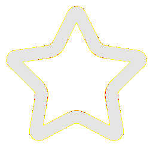
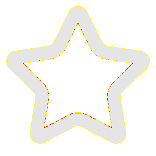

# Visual-diff: `lucide:star`

Generated 2026-05-16. Phase 1.5 three-way diff (see RESEARCH_PLAN §26 / §33b).

- **Package**: `iconifyx_lucide`
- **Primary codepoint**: `0xe314`
- **Primary font family**: `Lucide_2`
- **Duotone**: no

## Verdict

- **Status**: `same`
- **Primary reason**: `OK_3WAY`
- **Confidence**: `high`
- **Problem**: —
- **Remediation**: —

## Frames

| Layer | Image |
|---|---|
| Upstream Iconify SVG (resvg) |  |
| TTF primary glyph (em-box) |  |
| TTF composed (pure-TS, kind=solo) |  |
| Flutter rendered (IconifyIcon, fvm flutter test) |  |

## Diffs

| Pair | Heat-map | Metrics |
|---|---|---|
| SVG vs TTF (generator/build stage) |  | mismatch=0.16% ham=1 ssim=0.947 |
| TTF vs Flutter (widget render stage) |  | mismatch=0.32% ham=1 ssim=0.945 |
| SVG vs Flutter (end-to-end) |  | mismatch=0.01% ham=0 ssim=0.968 |

## Glyph metrics (raw TTF)

| Layer | Font | Glyph name | Advance | LSB | bbox xMin..xMax | bbox yMin..yMax | Centroid |
|---|---|---|---:|---:|---|---|---|
| primary | `Lucide_2.ttf` | `star` | 1000 | 0 | 42.0..958.1 | 81.0..957.7 | (500, 519) |

## End-to-end metrics (SVG vs Flutter)

- Canvas: 256 × 256
- Mismatch: 5 / 65,536 px (0.01 %)
- Ink ratio upstream: 0.2365
- Ink ratio Flutter:  0.2420
- Centroid drift: (-0.0, -0.3) px
- dHash: `0010108642005244` vs `0010108642005244` (Hamming 0/64)
- SSIM: 0.9676
