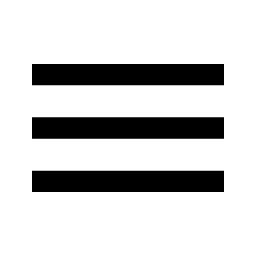
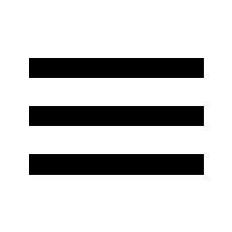
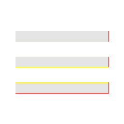
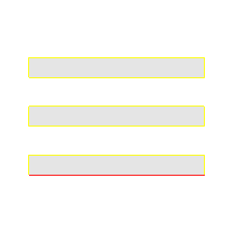
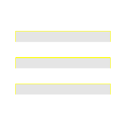

# Visual-diff: `material-symbols:menu`

Generated 2026-05-16. Phase 1.5 three-way diff (see RESEARCH_PLAN §26 / §33b).

- **Package**: `iconifyx_material_symbols`
- **Primary codepoint**: `0xef96`
- **Primary font family**: `MaterialSymbols_2`
- **Duotone**: no

## Verdict

- **Status**: `same`
- **Primary reason**: `OK_3WAY`
- **Confidence**: `high`
- **Problem**: —
- **Remediation**: —

## Frames

| Layer | Image |
|---|---|
| Upstream Iconify SVG (resvg) |  |
| TTF primary glyph (em-box) |  |
| TTF composed (pure-TS, kind=solo) |  |
| Flutter rendered (IconifyIcon, fvm flutter test) |  |

## Diffs

| Pair | Heat-map | Metrics |
|---|---|---|
| SVG vs TTF (generator/build stage) |  | mismatch=0.40% ham=1 ssim=0.956 |
| TTF vs Flutter (widget render stage) |  | mismatch=0.29% ham=1 ssim=0.933 |
| SVG vs Flutter (end-to-end) |  | mismatch=0.00% ham=0 ssim=0.956 |

## Glyph metrics (raw TTF)

| Layer | Font | Glyph name | Advance | LSB | bbox xMin..xMax | bbox yMin..yMax | Centroid |
|---|---|---|---:|---:|---|---|---|
| primary | `MaterialSymbols_2.ttf` | `menu` | 1000 | 0 | 125.0..875.0 | 250.0..750.0 | (500, 500) |

## End-to-end metrics (SVG vs Flutter)

- Canvas: 256 × 256
- Mismatch: 0 / 65,536 px (0.00 %)
- Ink ratio upstream: 0.1875
- Ink ratio Flutter:  0.1934
- Centroid drift: (0.0, -0.3) px
- dHash: `0000400040000000` vs `0000400040000000` (Hamming 0/64)
- SSIM: 0.9560
