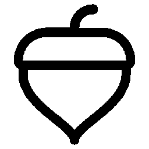
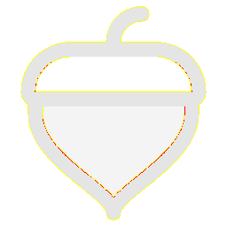

# Visual-diff: `ph:acorn-duotone`

Generated 2026-05-16. Phase 1.5 three-way diff (see RESEARCH_PLAN §26 / §33b).

- **Package**: `iconifyx_ph`
- **Primary codepoint**: `0xe002`
- **Primary font family**: `Ph`
- **Duotone**: yes (kind=hint)
- **Secondary font family**: `PhSecondary`

## Verdict

- **Status**: `different`
- **Primary reason**: `DUOTONE_BBOX_MISMATCH`
- **Confidence**: `high`
- **Problem**: Primary glyph centroid (500,500) differs from secondary (500,313) by 0.0% / 18.7% of em — layers will overlay misaligned
- **Remediation**: GLYPH_METRICS_AUDIT.md likely flags this pair. Root cause is usually svg2ttf glyph dedup (identical SVG bodies collapsed into one glyph with whichever first-encountered xMin) — see RESEARCH_PLAN §33 for fix.

## Frames

| Layer | Image |
|---|---|
| Upstream Iconify SVG (resvg) |  |
| TTF primary glyph (em-box) |  |
| TTF secondary glyph (em-box) |  |
| TTF composed (pure-TS, kind=hint) |  |
| Flutter rendered (IconifyIcon, fvm flutter test) |  |

## Diffs

| Pair | Heat-map | Metrics |
|---|---|---|
| SVG vs TTF (generator/build stage) |  | mismatch=16.00% ham=0 ssim=0.940 |
| TTF vs Flutter (widget render stage) |  | mismatch=0.27% ham=1 ssim=0.920 |
| SVG vs Flutter (end-to-end) |  | mismatch=15.28% ham=1 ssim=0.925 |

## Glyph metrics (raw TTF)

| Layer | Font | Glyph name | Advance | LSB | bbox xMin..xMax | bbox yMin..yMax | Centroid |
|---|---|---|---:|---:|---|---|---|
| primary | `Ph.ttf` | `acorn` | 1000 | 0 | 94.0..906.0 | 31.0..969.0 | (500, 500) |
| secondary | `PhSecondary.ttf` | `acorn-duotone` | 1000 | 0 | 156.0..844.0 | 63.0..563.0 | (500, 313) |

## End-to-end metrics (SVG vs Flutter)

- Canvas: 256 × 256
- Mismatch: 10,016 / 65,536 px (15.28 %)
- Ink ratio upstream: 0.1986
- Ink ratio Flutter:  0.2075
- Centroid drift: (-0.2, 0.1) px
- dHash: `0000428140422410` vs `0008428140422410` (Hamming 1/64)
- SSIM: 0.9250

## Duotone alignment (TTF-space)

- **Primary centroid**: (500.0, 500.0) in em-units of 1000
- **Secondary centroid**: (500.0, 313.0)
- **Centroid delta**: (0.0, -187.0) em-units
- **Fraction of em**: (0.0 %, 18.7 %)

> WARN: Centroid drift exceeds the 4 % threshold beyond which the two layers will visibly overlay out of alignment.
