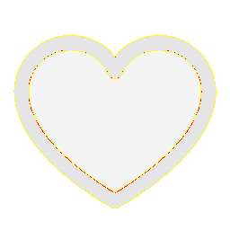

# Visual-diff: `ph:heart-duotone`

Generated 2026-05-16. Phase 1.5 three-way diff (see RESEARCH_PLAN §26 / §33b).

- **Package**: `iconifyx_ph`
- **Primary codepoint**: `0xf23e`
- **Primary font family**: `Ph`
- **Duotone**: yes (kind=hint)
- **Secondary font family**: `PhSecondary`

## Verdict

- **Status**: `needs-review`
- **Primary reason**: `MINOR_DIFF_3WAY`
- **Confidence**: `low`
- **Problem**: One or more pairwise diffs in the mild-mismatch band (likely AA noise or opacity)
- **Remediation**: Manual inspect; bump --size to confirm if structural

## Frames

| Layer | Image |
|---|---|
| Upstream Iconify SVG (resvg) |  |
| TTF primary glyph (em-box) |  |
| TTF secondary glyph (em-box) |  |
| TTF composed (pure-TS, kind=hint) |  |
| Flutter rendered (IconifyIcon, fvm flutter test) |  |

## Diffs

| Pair | Heat-map | Metrics |
|---|---|---|
| SVG vs TTF (generator/build stage) |  | mismatch=31.85% ham=0 ssim=0.939 |
| TTF vs Flutter (widget render stage) |  | mismatch=0.29% ham=0 ssim=0.945 |
| SVG vs Flutter (end-to-end) |  | mismatch=31.25% ham=0 ssim=0.942 |

## Glyph metrics (raw TTF)

| Layer | Font | Glyph name | Advance | LSB | bbox xMin..xMax | bbox yMin..yMax | Centroid |
|---|---|---|---:|---:|---|---|---|
| primary | `Ph.ttf` | `heart` | 1000 | 0 | 63.0..938.0 | 94.0..844.0 | (501, 469) |
| secondary | `PhSecondary.ttf` | `heart-duotone` | 1000 | 0 | 94.0..906.0 | 125.0..813.0 | (500, 469) |

## End-to-end metrics (SVG vs Flutter)

- Canvas: 256 × 256
- Mismatch: 20,482 / 65,536 px (31.25 %)
- Ink ratio upstream: 0.1541
- Ink ratio Flutter:  0.1623
- Centroid drift: (0.1, -0.1) px
- dHash: `0000918181422410` vs `0000918181422410` (Hamming 0/64)
- SSIM: 0.9423

## Duotone alignment (TTF-space)

- **Primary centroid**: (500.5, 469.0) in em-units of 1000
- **Secondary centroid**: (500.0, 469.0)
- **Centroid delta**: (-0.5, 0.0) em-units
- **Fraction of em**: (0.1 %, 0.0 %)
