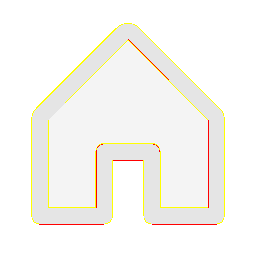

# Visual-diff: `ph:house-duotone`

Generated 2026-05-16. Phase 1.5 three-way diff (see RESEARCH_PLAN §26 / §33b).

- **Package**: `iconifyx_ph`
- **Primary codepoint**: `0xf2c2`
- **Primary font family**: `Ph`
- **Duotone**: yes (kind=hint)
- **Secondary font family**: `PhSecondary`

## Verdict

- **Status**: `needs-review`
- **Primary reason**: `MINOR_DIFF_3WAY`
- **Confidence**: `low`
- **Problem**: One or more pairwise diffs in the mild-mismatch band (likely AA noise or opacity)
- **Remediation**: Manual inspect; bump --size to confirm if structural

## Frames

| Layer | Image |
|---|---|
| Upstream Iconify SVG (resvg) |  |
| TTF primary glyph (em-box) |  |
| TTF secondary glyph (em-box) |  |
| TTF composed (pure-TS, kind=hint) |  |
| Flutter rendered (IconifyIcon, fvm flutter test) |  |

## Diffs

| Pair | Heat-map | Metrics |
|---|---|---|
| SVG vs TTF (generator/build stage) |  | mismatch=25.69% ham=4 ssim=0.898 |
| TTF vs Flutter (widget render stage) |  | mismatch=0.55% ham=4 ssim=0.876 |
| SVG vs Flutter (end-to-end) |  | mismatch=23.98% ham=0 ssim=0.890 |

## Glyph metrics (raw TTF)

| Layer | Font | Glyph name | Advance | LSB | bbox xMin..xMax | bbox yMin..yMax | Centroid |
|---|---|---|---:|---:|---|---|---|
| primary | `Ph.ttf` | `house` | 1000 | 0 | 125.0..875.0 | 125.0..906.0 | (500, 516) |
| secondary | `PhSecondary.ttf` | `house-duotone` | 1000 | 0 | 156.0..844.0 | 156.0..875.0 | (500, 516) |

## End-to-end metrics (SVG vs Flutter)

- Canvas: 256 × 256
- Mismatch: 15,716 / 65,536 px (23.98 %)
- Ink ratio upstream: 0.1823
- Ink ratio Flutter:  0.1906
- Centroid drift: (-0.6, -0.3) px
- dHash: `0010244240444400` vs `0010244240444400` (Hamming 0/64)
- SSIM: 0.8901

## Duotone alignment (TTF-space)

- **Primary centroid**: (500.0, 515.5) in em-units of 1000
- **Secondary centroid**: (500.0, 515.5)
- **Centroid delta**: (0.0, 0.0) em-units
- **Fraction of em**: (0.0 %, 0.0 %)
