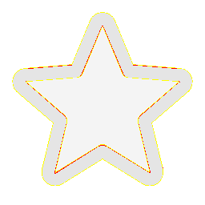

# Visual-diff: `ph:star-duotone`

Generated 2026-05-16. Phase 1.5 three-way diff (see RESEARCH_PLAN §26 / §33b).

- **Package**: `iconifyx_ph`
- **Primary codepoint**: `0xe72e`
- **Primary font family**: `Ph_2`
- **Duotone**: yes (kind=hint)
- **Secondary font family**: `Ph_2Secondary`

## Verdict

- **Status**: `needs-review`
- **Primary reason**: `MINOR_DIFF_3WAY`
- **Confidence**: `low`
- **Problem**: One or more pairwise diffs in the mild-mismatch band (likely AA noise or opacity)
- **Remediation**: Manual inspect; bump --size to confirm if structural

## Frames

| Layer | Image |
|---|---|
| Upstream Iconify SVG (resvg) |  |
| TTF primary glyph (em-box) |  |
| TTF secondary glyph (em-box) |  |
| TTF composed (pure-TS, kind=hint) |  |
| Flutter rendered (IconifyIcon, fvm flutter test) |  |

## Diffs

| Pair | Heat-map | Metrics |
|---|---|---|
| SVG vs TTF (generator/build stage) |  | mismatch=20.70% ham=1 ssim=0.940 |
| TTF vs Flutter (widget render stage) |  | mismatch=0.53% ham=1 ssim=0.928 |
| SVG vs Flutter (end-to-end) |  | mismatch=19.98% ham=0 ssim=0.951 |

## Glyph metrics (raw TTF)

| Layer | Font | Glyph name | Advance | LSB | bbox xMin..xMax | bbox yMin..yMax | Centroid |
|---|---|---|---:|---:|---|---|---|
| primary | `Ph_2.ttf` | `star` | 1000 | 0 | 62.7..937.3 | 93.9..937.0 | (500, 515) |
| secondary | `Ph_2Secondary.ttf` | `star-duotone` | 1000 | 0 | 94.4..905.6 | 125.5..906.0 | (500, 516) |

## End-to-end metrics (SVG vs Flutter)

- Canvas: 256 × 256
- Mismatch: 13,094 / 65,536 px (19.98 %)
- Ink ratio upstream: 0.1824
- Ink ratio Flutter:  0.1921
- Centroid drift: (0.1, -0.3) px
- dHash: `0010108442203046` vs `0010108442203046` (Hamming 0/64)
- SSIM: 0.9507

## Duotone alignment (TTF-space)

- **Primary centroid**: (500.0, 515.5) in em-units of 1000
- **Secondary centroid**: (500.0, 515.7)
- **Centroid delta**: (0.0, 0.3) em-units
- **Fraction of em**: (0.0 %, 0.0 %)
