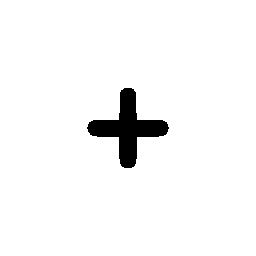
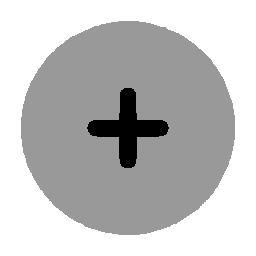
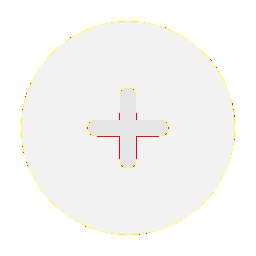
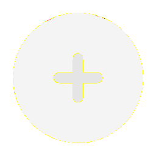
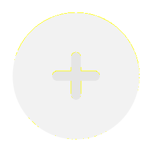

# Visual-diff: `solar:add-circle-bold-duotone`

Generated 2026-05-16. Phase 1.5 three-way diff (see RESEARCH_PLAN §26 / §33b).

- **Package**: `iconifyx_solar`
- **Primary codepoint**: `0xe013`
- **Primary font family**: `Solar`
- **Duotone**: yes (kind=hint)
- **Secondary font family**: `SolarSecondary`

## Verdict

- **Status**: `same`
- **Primary reason**: `OK_3WAY`
- **Confidence**: `high`
- **Problem**: —
- **Remediation**: —

## Frames

| Layer | Image |
|---|---|
| Upstream Iconify SVG (resvg) |  |
| TTF primary glyph (em-box) |  |
| TTF secondary glyph (em-box) |  |
| TTF composed (pure-TS, kind=hint) |  |
| Flutter rendered (IconifyIcon, fvm flutter test) |  |

## Diffs

| Pair | Heat-map | Metrics |
|---|---|---|
| SVG vs TTF (generator/build stage) |  | mismatch=0.22% ham=0 ssim=0.960 |
| TTF vs Flutter (widget render stage) |  | mismatch=0.01% ham=0 ssim=0.969 |
| SVG vs Flutter (end-to-end) |  | mismatch=0.00% ham=0 ssim=0.963 |

## Glyph metrics (raw TTF)

| Layer | Font | Glyph name | Advance | LSB | bbox xMin..xMax | bbox yMin..yMax | Centroid |
|---|---|---|---:|---:|---|---|---|
| primary | `Solar.ttf` | `add-circle-bold-duotone` | 1000 | 0 | 343.6..656.4 | 344.0..655.7 | (500, 500) |
| secondary | `SolarSecondary.ttf` | `accessibility-bold-duotone` | 1000 | 0 | 83.6..917.0 | 83.2..916.5 | (500, 500) |

## End-to-end metrics (SVG vs Flutter)

- Canvas: 256 × 256
- Mismatch: 0 / 65,536 px (0.00 %)
- Ink ratio upstream: 0.0339
- Ink ratio Flutter:  0.0369
- Centroid drift: (0.0, -0.2) px
- dHash: `0020408090804020` vs `0020408090804020` (Hamming 0/64)
- SSIM: 0.9634

## Duotone alignment (TTF-space)

- **Primary centroid**: (500.0, 499.8) in em-units of 1000
- **Secondary centroid**: (500.3, 499.9)
- **Centroid delta**: (0.3, 0.0) em-units
- **Fraction of em**: (0.0 %, 0.0 %)
