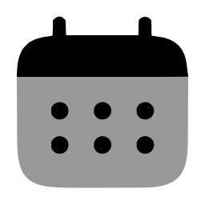
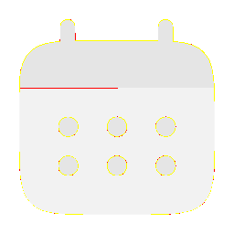
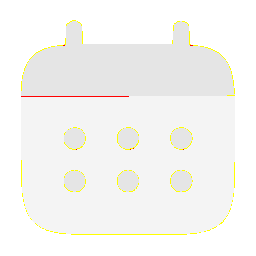
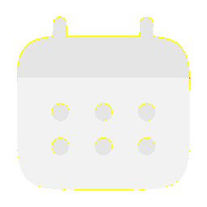

# Visual-diff: `solar:calendar-bold-duotone`

Generated 2026-05-16. Phase 1.5 three-way diff (see RESEARCH_PLAN §26 / §33b).

- **Package**: `iconifyx_solar`
- **Primary codepoint**: `0xe397`
- **Primary font family**: `Solar`
- **Duotone**: yes (kind=hint)
- **Secondary font family**: `SolarSecondary`

## Verdict

- **Status**: `different`
- **Primary reason**: `DUOTONE_BBOX_MISMATCH`
- **Confidence**: `high`
- **Problem**: Primary glyph centroid (500,584) differs from secondary (500,354) by 0.0% / 22.9% of em — layers will overlay misaligned
- **Remediation**: GLYPH_METRICS_AUDIT.md likely flags this pair. Root cause is usually svg2ttf glyph dedup (identical SVG bodies collapsed into one glyph with whichever first-encountered xMin) — see RESEARCH_PLAN §33 for fix.

## Frames

| Layer | Image |
|---|---|
| Upstream Iconify SVG (resvg) |  |
| TTF primary glyph (em-box) |  |
| TTF secondary glyph (em-box) |  |
| TTF composed (pure-TS, kind=hint) |  |
| Flutter rendered (IconifyIcon, fvm flutter test) |  |

## Diffs

| Pair | Heat-map | Metrics |
|---|---|---|
| SVG vs TTF (generator/build stage) |  | mismatch=0.25% ham=0 ssim=0.952 |
| TTF vs Flutter (widget render stage) |  | mismatch=0.18% ham=0 ssim=0.964 |
| SVG vs Flutter (end-to-end) |  | mismatch=0.00% ham=0 ssim=0.975 |

## Glyph metrics (raw TTF)

| Layer | Font | Glyph name | Advance | LSB | bbox xMin..xMax | bbox yMin..yMax | Centroid |
|---|---|---|---:|---:|---|---|---|
| primary | `Solar.ttf` | `calendar-bold-duotone` | 1000 | 0 | 83.0..917.0 | 250.1..917.0 | (500, 584) |
| secondary | `SolarSecondary.ttf` | `calendar-bold-duotone` | 1000 | 0 | 83.0..917.0 | 83.7..625.0 | (500, 354) |

## End-to-end metrics (SVG vs Flutter)

- Canvas: 256 × 256
- Mismatch: 1 / 65,536 px (0.00 %)
- Ink ratio upstream: 0.2002
- Ink ratio Flutter:  0.2035
- Centroid drift: (0.0, -0.3) px
- dHash: `0000808080808040` vs `0000808080808040` (Hamming 0/64)
- SSIM: 0.9748

## Duotone alignment (TTF-space)

- **Primary centroid**: (500.0, 583.6) in em-units of 1000
- **Secondary centroid**: (500.0, 354.3)
- **Centroid delta**: (0.0, -229.2) em-units
- **Fraction of em**: (0.0 %, 22.9 %)

> WARN: Centroid drift exceeds the 4 % threshold beyond which the two layers will visibly overlay out of alignment.
