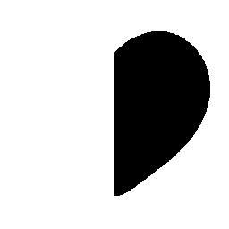
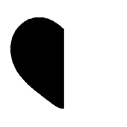
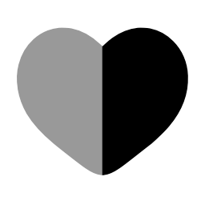
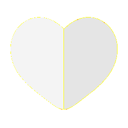

# Visual-diff: `solar:heart-bold-duotone`

Generated 2026-05-16. Phase 1.5 three-way diff (see RESEARCH_PLAN §26 / §33b).

- **Package**: `iconifyx_solar`
- **Primary codepoint**: `0xeb7d`
- **Primary font family**: `Solar`
- **Duotone**: yes (kind=hint)
- **Secondary font family**: `SolarSecondary`

## Verdict

- **Status**: `different`
- **Primary reason**: `DUOTONE_BBOX_MISMATCH`
- **Confidence**: `high`
- **Problem**: Primary glyph centroid (708,504) differs from secondary (292,504) by 41.7% / 0.0% of em — layers will overlay misaligned
- **Remediation**: GLYPH_METRICS_AUDIT.md likely flags this pair. Root cause is usually svg2ttf glyph dedup (identical SVG bodies collapsed into one glyph with whichever first-encountered xMin) — see RESEARCH_PLAN §33 for fix.

## Frames

| Layer | Image |
|---|---|
| Upstream Iconify SVG (resvg) |  |
| TTF primary glyph (em-box) |  |
| TTF secondary glyph (em-box) |  |
| TTF composed (pure-TS, kind=hint) |  |
| Flutter rendered (IconifyIcon, fvm flutter test) |  |

## Diffs

| Pair | Heat-map | Metrics |
|---|---|---|
| SVG vs TTF (generator/build stage) |  | mismatch=0.02% ham=0 ssim=0.985 |
| TTF vs Flutter (widget render stage) |  | mismatch=0.01% ham=0 ssim=0.977 |
| SVG vs Flutter (end-to-end) |  | mismatch=0.00% ham=0 ssim=0.976 |

## Glyph metrics (raw TTF)

| Layer | Font | Glyph name | Advance | LSB | bbox xMin..xMax | bbox yMin..yMax | Centroid |
|---|---|---|---:|---:|---|---|---|
| primary | `Solar.ttf` | `heart-bold-duotone` | 1000 | 0 | 500.0..916.2 | 145.0..862.5 | (708, 504) |
| secondary | `SolarSecondary.ttf` | `heart-bold-duotone` | 1000 | 0 | 83.2..500.0 | 145.0..862.5 | (292, 504) |

## End-to-end metrics (SVG vs Flutter)

- Canvas: 256 × 256
- Mismatch: 1 / 65,536 px (0.00 %)
- Ink ratio upstream: 0.2204
- Ink ratio Flutter:  0.2238
- Centroid drift: (-0.5, 0.0) px
- dHash: `0000488888482800` vs `0000488888482800` (Hamming 0/64)
- SSIM: 0.9755

## Duotone alignment (TTF-space)

- **Primary centroid**: (708.1, 503.8) in em-units of 1000
- **Secondary centroid**: (291.6, 503.8)
- **Centroid delta**: (-416.5, 0.0) em-units
- **Fraction of em**: (41.7 %, 0.0 %)

> WARN: Centroid drift exceeds the 4 % threshold beyond which the two layers will visibly overlay out of alignment.
