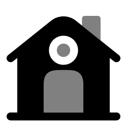
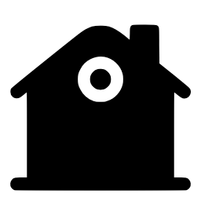
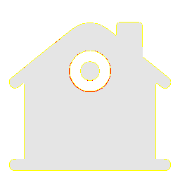
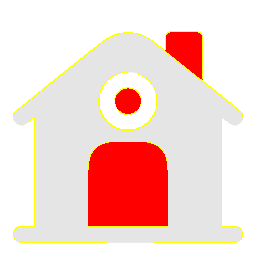

# Visual-diff: `solar:home-bold-duotone`

Generated 2026-05-16. Phase 1.5 three-way diff (see RESEARCH_PLAN §26 / §33b).

- **Package**: `iconifyx_solar`
- **Primary codepoint**: `0xec01`
- **Primary font family**: `Solar`
- **Duotone**: no

## Verdict

- **Status**: `needs-review`
- **Primary reason**: `MINOR_DIFF_3WAY`
- **Confidence**: `low`
- **Problem**: One or more pairwise diffs in the mild-mismatch band (likely AA noise or opacity)
- **Remediation**: Manual inspect; bump --size to confirm if structural

## Frames

| Layer | Image |
|---|---|
| Upstream Iconify SVG (resvg) |  |
| TTF primary glyph (em-box) |  |
| TTF composed (pure-TS, kind=solo) |  |
| Flutter rendered (IconifyIcon, fvm flutter test) |  |

## Diffs

| Pair | Heat-map | Metrics |
|---|---|---|
| SVG vs TTF (generator/build stage) |  | mismatch=12.47% ham=3 ssim=0.827 |
| TTF vs Flutter (widget render stage) |  | mismatch=0.15% ham=0 ssim=0.968 |
| SVG vs Flutter (end-to-end) |  | mismatch=12.44% ham=3 ssim=0.831 |

## Glyph metrics (raw TTF)

| Layer | Font | Glyph name | Advance | LSB | bbox xMin..xMax | bbox yMin..yMax | Centroid |
|---|---|---|---:|---:|---|---|---|
| primary | `Solar.ttf` | `home-bold-duotone` | 1000 | 0 | 52.3..948.0 | 52.0..875.0 | (500, 464) |

## End-to-end metrics (SVG vs Flutter)

- Canvas: 256 × 256
- Mismatch: 8,151 / 65,536 px (12.44 %)
- Ink ratio upstream: 0.4017
- Ink ratio Flutter:  0.5345
- Centroid drift: (2.1, 2.4) px
- dHash: `0004204440444444` vs `0004204440404040` (Hamming 3/64)
- SSIM: 0.8310
