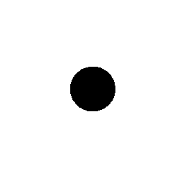
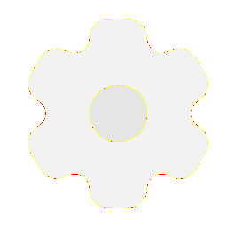
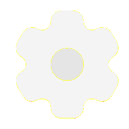
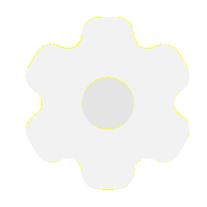

# Visual-diff: `solar:settings-bold-duotone`

Generated 2026-05-16. Phase 1.5 three-way diff (see RESEARCH_PLAN §26 / §33b).

- **Package**: `iconifyx_solar`
- **Primary codepoint**: `0xf513`
- **Primary font family**: `Solar`
- **Duotone**: yes (kind=hint)
- **Secondary font family**: `SolarSecondary`

## Verdict

- **Status**: `same`
- **Primary reason**: `OK_3WAY`
- **Confidence**: `high`
- **Problem**: —
- **Remediation**: —

## Frames

| Layer | Image |
|---|---|
| Upstream Iconify SVG (resvg) |  |
| TTF primary glyph (em-box) |  |
| TTF secondary glyph (em-box) |  |
| TTF composed (pure-TS, kind=hint) |  |
| Flutter rendered (IconifyIcon, fvm flutter test) |  |

## Diffs

| Pair | Heat-map | Metrics |
|---|---|---|
| SVG vs TTF (generator/build stage) |  | mismatch=0.13% ham=0 ssim=0.966 |
| TTF vs Flutter (widget render stage) |  | mismatch=0.00% ham=1 ssim=0.982 |
| SVG vs Flutter (end-to-end) |  | mismatch=0.00% ham=1 ssim=0.978 |

## Glyph metrics (raw TTF)

| Layer | Font | Glyph name | Advance | LSB | bbox xMin..xMax | bbox yMin..yMax | Centroid |
|---|---|---|---:|---:|---|---|---|
| primary | `Solar.ttf` | `settings-bold-duotone` | 1000 | 0 | 395.1..646.6 | 376.0..624.3 | (521, 500) |
| secondary | `SolarSecondary.ttf` | `settings-bold-duotone` | 1000 | 0 | 125.0..916.0 | 84.0..915.7 | (521, 500) |

## End-to-end metrics (SVG vs Flutter)

- Canvas: 256 × 256
- Mismatch: 0 / 65,536 px (0.00 %)
- Ink ratio upstream: 0.0508
- Ink ratio Flutter:  0.0510
- Centroid drift: (-0.1, -0.3) px
- dHash: `0010404050404010` vs `0010404850404010` (Hamming 1/64)
- SSIM: 0.9777

## Duotone alignment (TTF-space)

- **Primary centroid**: (520.9, 500.2) in em-units of 1000
- **Secondary centroid**: (520.5, 499.8)
- **Centroid delta**: (-0.4, -0.3) em-units
- **Fraction of em**: (0.0 %, 0.0 %)
