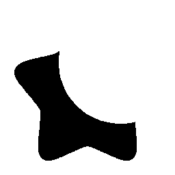
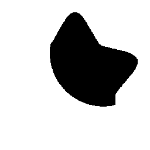
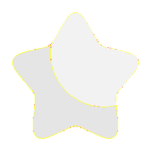
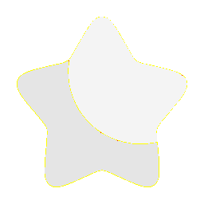
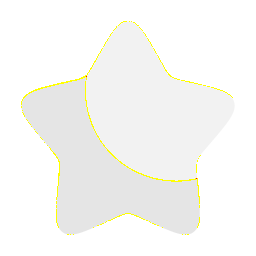

# Visual-diff: `solar:star-bold-duotone`

Generated 2026-05-16. Phase 1.5 three-way diff (see RESEARCH_PLAN §26 / §33b).

- **Package**: `iconifyx_solar`
- **Primary codepoint**: `0xe05b`
- **Primary font family**: `Solar_2`
- **Duotone**: yes (kind=hint)
- **Secondary font family**: `Solar_2Secondary`

## Verdict

- **Status**: `different`
- **Primary reason**: `DUOTONE_BBOX_MISMATCH`
- **Confidence**: `high`
- **Problem**: Primary glyph centroid (432,394) differs from secondary (625,604) by 19.4% / 21.0% of em — layers will overlay misaligned
- **Remediation**: GLYPH_METRICS_AUDIT.md likely flags this pair. Root cause is usually svg2ttf glyph dedup (identical SVG bodies collapsed into one glyph with whichever first-encountered xMin) — see RESEARCH_PLAN §33 for fix.

## Frames

| Layer | Image |
|---|---|
| Upstream Iconify SVG (resvg) |  |
| TTF primary glyph (em-box) |  |
| TTF secondary glyph (em-box) |  |
| TTF composed (pure-TS, kind=hint) |  |
| Flutter rendered (IconifyIcon, fvm flutter test) |  |

## Diffs

| Pair | Heat-map | Metrics |
|---|---|---|
| SVG vs TTF (generator/build stage) |  | mismatch=0.05% ham=0 ssim=0.965 |
| TTF vs Flutter (widget render stage) |  | mismatch=0.01% ham=0 ssim=0.979 |
| SVG vs Flutter (end-to-end) |  | mismatch=0.00% ham=0 ssim=0.976 |

## Glyph metrics (raw TTF)

| Layer | Font | Glyph name | Advance | LSB | bbox xMin..xMax | bbox yMin..yMax | Centroid |
|---|---|---|---:|---:|---|---|---|
| primary | `Solar_2.ttf` | `star-bold-duotone` | 1000 | 0 | 83.6..779.5 | 83.5..704.0 | (432, 394) |
| secondary | `Solar_2Secondary.ttf` | `star-bold-duotone` | 1000 | 0 | 333.7..916.6 | 291.8..916.3 | (625, 604) |

## End-to-end metrics (SVG vs Flutter)

- Canvas: 256 × 256
- Mismatch: 2 / 65,536 px (0.00 %)
- Ink ratio upstream: 0.1926
- Ink ratio Flutter:  0.1950
- Centroid drift: (0.1, -0.3) px
- dHash: `0010108040202024` vs `0010108040202024` (Hamming 0/64)
- SSIM: 0.9763

## Duotone alignment (TTF-space)

- **Primary centroid**: (431.6, 393.8) in em-units of 1000
- **Secondary centroid**: (625.1, 604.0)
- **Centroid delta**: (193.6, 210.3) em-units
- **Fraction of em**: (19.4 %, 21.0 %)

> WARN: Centroid drift exceeds the 4 % threshold beyond which the two layers will visibly overlay out of alignment.
