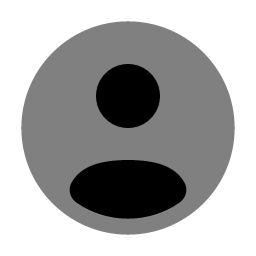
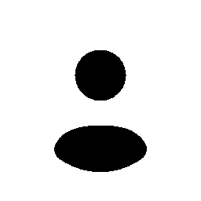
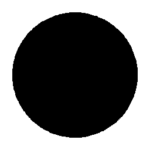
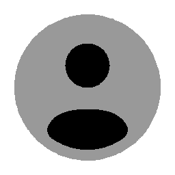
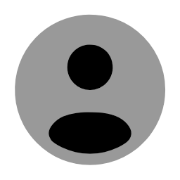
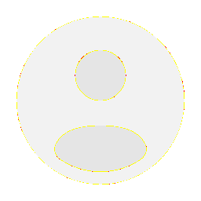
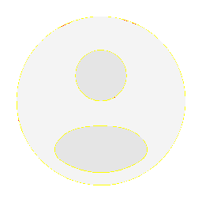
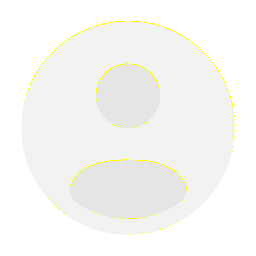

# Visual-diff: `solar:user-circle-bold-duotone`

Generated 2026-05-16. Phase 1.5 three-way diff (see RESEARCH_PLAN §26 / §33b).

- **Package**: `iconifyx_solar`
- **Primary codepoint**: `0xe3a6`
- **Primary font family**: `Solar_2`
- **Duotone**: yes (kind=hint)
- **Secondary font family**: `Solar_2Secondary`

## Verdict

- **Status**: `needs-review`
- **Primary reason**: `DUOTONE_BBOX_SHARED_SECONDARY`
- **Confidence**: `medium`
- **Problem**: Primary centroid (500,448) differs from secondary (500,500) by 0.0% / 5.2% of em; secondary glyph is the SHARED "star-circle-bold-duotone" (dedup), so the primary's asymmetry is intentional — not a render bug, but worth eyeballing.
- **Remediation**: Manual visual check — typical of Solar / Phosphor duotone families where the secondary is a generic ring

## Frames

| Layer | Image |
|---|---|
| Upstream Iconify SVG (resvg) |  |
| TTF primary glyph (em-box) |  |
| TTF secondary glyph (em-box) |  |
| TTF composed (pure-TS, kind=hint) |  |
| Flutter rendered (IconifyIcon, fvm flutter test) |  |

## Diffs

| Pair | Heat-map | Metrics |
|---|---|---|
| SVG vs TTF (generator/build stage) |  | mismatch=0.07% ham=0 ssim=0.955 |
| TTF vs Flutter (widget render stage) |  | mismatch=0.02% ham=1 ssim=0.969 |
| SVG vs Flutter (end-to-end) |  | mismatch=0.00% ham=1 ssim=0.970 |

## Glyph metrics (raw TTF)

| Layer | Font | Glyph name | Advance | LSB | bbox xMin..xMax | bbox yMin..yMax | Centroid |
|---|---|---|---:|---:|---|---|---|
| primary | `Solar_2.ttf` | `user-circle-bold-duotone` | 1000 | 0 | 272.0..728.3 | 146.0..749.3 | (500, 448) |
| secondary | `Solar_2Secondary.ttf` | `star-circle-bold-duotone` | 1000 | 0 | 83.6..917.0 | 83.2..916.5 | (500, 500) |

## End-to-end metrics (SVG vs Flutter)

- Canvas: 256 × 256
- Mismatch: 0 / 65,536 px (0.00 %)
- Ink ratio upstream: 0.1338
- Ink ratio Flutter:  0.1348
- Centroid drift: (0.0, -0.4) px
- dHash: `0020409080906020` vs `0020409080986020` (Hamming 1/64)
- SSIM: 0.9700

## Duotone alignment (TTF-space)

- **Primary centroid**: (500.2, 447.7) in em-units of 1000
- **Secondary centroid**: (500.3, 499.9)
- **Centroid delta**: (0.1, 52.2) em-units
- **Fraction of em**: (0.0 %, 5.2 %)

> WARN: Centroid drift exceeds the 4 % threshold beyond which the two layers will visibly overlay out of alignment.
