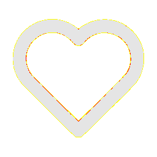

# Visual-diff: `tabler:heart`

Generated 2026-05-16. Phase 1.5 three-way diff (see RESEARCH_PLAN §26 / §33b).

- **Package**: `iconifyx_tabler`
- **Primary codepoint**: `0xe474`
- **Primary font family**: `Tabler_3`
- **Duotone**: no

## Verdict

- **Status**: `needs-review`
- **Primary reason**: `MINOR_DIFF_3WAY`
- **Confidence**: `low`
- **Problem**: One or more pairwise diffs in the mild-mismatch band (likely AA noise or opacity)
- **Remediation**: Manual inspect; bump --size to confirm if structural

## Frames

| Layer | Image |
|---|---|
| Upstream Iconify SVG (resvg) |  |
| TTF primary glyph (em-box) |  |
| TTF composed (pure-TS, kind=solo) |  |
| Flutter rendered (IconifyIcon, fvm flutter test) |  |

## Diffs

| Pair | Heat-map | Metrics |
|---|---|---|
| SVG vs TTF (generator/build stage) |  | mismatch=0.06% ham=3 ssim=0.960 |
| TTF vs Flutter (widget render stage) |  | mismatch=0.28% ham=5 ssim=0.953 |
| SVG vs Flutter (end-to-end) |  | mismatch=0.00% ham=2 ssim=0.970 |

## Glyph metrics (raw TTF)

| Layer | Font | Glyph name | Advance | LSB | bbox xMin..xMax | bbox yMin..yMax | Centroid |
|---|---|---|---:|---:|---|---|---|
| primary | `Tabler_3.ttf` | `heart` | 1000 | 0 | 83.0..916.3 | 126.0..874.7 | (500, 500) |

## End-to-end metrics (SVG vs Flutter)

- Canvas: 256 × 256
- Mismatch: 0 / 65,536 px (0.00 %)
- Ink ratio upstream: 0.1873
- Ink ratio Flutter:  0.1938
- Centroid drift: (0.1, 0.2) px
- dHash: `0024528142241000` vs `0024da8142241000` (Hamming 2/64)
- SSIM: 0.9695
