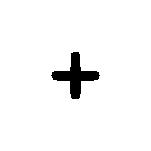
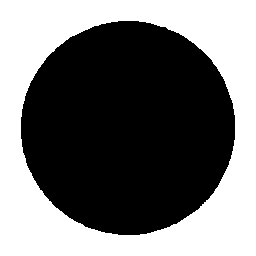

# Visual-diff: `solar:add-circle-bold-duotone`

Generated 2026-05-15. Phase 1 single-icon diff (see RESEARCH_PLAN §33).

- **Package**: `iconifyx_solar`
- **Primary codepoint**: `0xe013`
- **Primary font family**: `Solar`
- **Duotone**: yes (kind=hint)
- **Secondary font family**: `SolarSecondary`

## Verdict

- **Status**: `same`
- **Primary reason**: `TTF_OK`
- **Confidence**: `low`
- **Problem**: TTF-only checks pass; run without --skip-flutter for end-to-end verdict
- **Remediation**: —

## Frames

| Layer | Image |
|---|---|
| Upstream Iconify SVG (resvg) |  |
| TTF primary glyph (em-box) |  |
| TTF secondary glyph (em-box) |  |

## Glyph metrics (raw TTF)

| Layer | Font | Glyph name in TTF | Advance | LSB | bbox xMin..xMax | bbox yMin..yMax | Centroid |
|---|---|---|---:|---:|---|---|---|
| primary | `Solar.ttf` | `add-circle-bold-duotone` | 1000 | 0 | 343.6..656.4 | 344.0..655.7 | (500, 500) |
| secondary | `SolarSecondary.ttf` | `accessibility-bold-duotone` | 1000 | 0 | 83.6..917.0 | 83.2..916.5 | (500, 500) |

## Duotone alignment (TTF-space)

- **Primary centroid**: (500.0, 499.8) in em-units of 1000
- **Secondary centroid**: (500.3, 499.9)
- **Centroid delta**: (0.3, 0.0) em-units
- **Fraction of em**: (0.0 %, 0.0 %)
