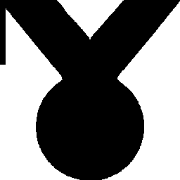

# Visual-diff: `twemoji:1st-place-medal`

Generated 2026-05-16. Phase 1 single-icon diff (see RESEARCH_PLAN §33).

- **Package**: `iconifyx_twemoji`
- **Primary codepoint**: `0xe2cb`
- **Primary font family**: `Twemoji`
- **Duotone**: yes (kind=paintOrder)
- **Secondary font family**: `TwemojiSecondary`

## Verdict

- **Status**: `different`
- **Primary reason**: `DUOTONE_BBOX_MISMATCH`
- **Confidence**: `high`
- **Problem**: Primary glyph centroid (447,502) differs from secondary (389,789) by 5.8% / 28.6% of em — layers will overlay misaligned
- **Remediation**: GLYPH_METRICS_AUDIT.md likely flags this pair. Root cause is usually svg2ttf glyph dedup (identical SVG bodies collapsed into one glyph with whichever first-encountered xMin) — see RESEARCH_PLAN §33 for fix.

## Frames

| Layer | Image |
|---|---|
| Upstream Iconify SVG (resvg) |  |
| TTF primary glyph (em-box) |  |
| TTF secondary glyph (em-box) |  |

## Glyph metrics (raw TTF)

| Layer | Font | Glyph name in TTF | Advance | LSB | bbox xMin..xMax | bbox yMin..yMax | Centroid |
|---|---|---|---:|---:|---|---|---|
| primary | `Twemoji.ttf` | `1st-place-medal` | 1000 | -107 | -106.0..1000.0 | -2.0..1007.0 | (447, 502) |
| secondary | `TwemojiSecondary.ttf` | `1st-place-medal` | 1000 | -222 | -222.0..1000.0 | 570.0..1007.0 | (389, 789) |

## Duotone alignment (TTF-space)

- **Primary centroid**: (447.0, 502.5) in em-units of 1000
- **Secondary centroid**: (389.0, 788.5)
- **Centroid delta**: (-58.0, 286.0) em-units
- **Fraction of em**: (5.8 %, 28.6 %)

> ⚠️ Centroid drift exceeds the 4 % threshold beyond which the two layers will visibly overlay out of alignment when `IconifyIcon` paints both at `Offset.zero`.
